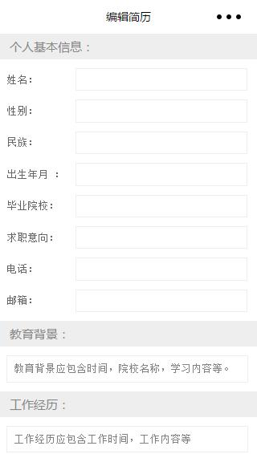
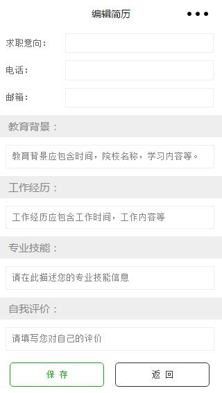
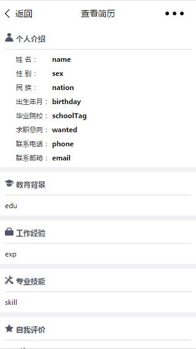
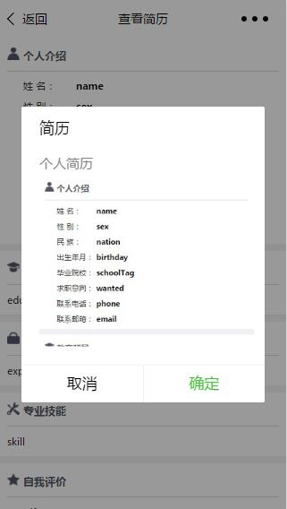

# 小程序--简历

## 前言

年初正是人才流动的高峰期，微信作为社交载体必不可少成为大家交流的载体，结合小程序的分享功能，便有了用小程序做简历并在聊天时直接发给boss的想法。

## 功能测试demo

为了验证想法的可行性，决定先进行功能测试。暂时不依赖后台的情况下数据需要存储在本地，而分享的话就需要把数据取出挂在url的参数上来传递，相关代码：

```
//index.js
Page({
  data: {
    inputValue: ''
  },
  // 绑定输入框，将输入数据存入data
  bindKeyInput: function(e) {
    this.setData({
      inputValue: e.detail.value
    })
  },
  // 跳转链接参数拼接
  jump: function() {
    wx.navigateTo({
      url: '../share/share?str='+this.data.inputValue
    })
  }
})
```

```
//share.js
Page({
  data: {
    content: ""
  },
  // 页面载入时从链接中取得参数并存入data
  onLoad: function(options){
    this.setData({
      content: options.str
    }) 
  },
  // 设置页面分享
  onShareAppMessage: function () {
    return {
      title: '简历',
      desc: '个人简历',
      path: '/pages/share/share?str='+this.data.content
    }
  }
})
```

功能测试没问题，接下来就开始动手开发。


## V 1.0

作为原始版本，这一版从最基础的功能开始做起，只有三个页面，分别为欢迎页，编辑简历页（集创建修改于一身），和简历查看页。

#### 欢迎页（主页）

欢迎页使用小程序quick start模板修改而成，通过微信授权获取用户头像和昵称，下方则是查看简历和编辑简历两个按钮，整体风格走简洁路线。

> 小程序中的onLoad函数自是在该页面首次加载时调用，在页面跳转中不会触发，而项目的查看页面需要从首页data中取值进行下一步操作，所以这里在进入编辑页的跳转绑定采用了wx.redirectTo ，即销毁当前页面并跳转，虽然进入编辑后不能直接按返回键回到主页，只能通过我提供的返回按钮返回，但是保证了数据的实时更新。


逻辑方面：

```
//index.js
//获取应用实例
var app = getApp()
Page({
  data: {
    userInfo: {},// 存放用户信息
    disabled: false,// 控制按钮是否可用
    name: '',// 存放用户信息
    sex: '',
    ……
    introduction: ''
  },
  // 页面加载时获取用户信息及本地存储的用户数据
  onLoad: function () {
    var that = this
    //调用应用实例的方法获取全局数据
    app.getUserInfo(function(userInfo){
      //更新数据
      that.setData({
        userInfo:userInfo
      })
    })
    // 从本地缓存中获取数据
    var name = wx.getStorageSync('name')
    var sex = wx.getStorageSync('sex')
    ……
    var introduction = wx.getStorageSync('introduction')
    // 判断数据是否存在
    if (name||sex||……||introduction) {
      // 数据存在，将获取的数据存入data
      that.setData({
        name: name,
        sex: sex,
        ……
        introduction: introduction
      })
    } else {
      // 数据不存在，禁用查看简历按钮
      that.setData({
        disabled: !this.data.disabled
      })
    }
  },
  // 查看简历按钮从data中取值拼接参数  保留首页
  show: function() {
    wx.navigateTo({
      url: '../show/show?name='+this.data.name+'&sex='+this.data.sex+'&nation='+this.data.nation+'&birthday='+this.data.birthday+'&schoolTag='+this.data.schoolTag+'&wanted='+this.data.wanted+'&phone='+this.data.phone+'&email='+this.data.email+'&education='+this.data.education+'&experience='+this.data.experience+'&skill='+this.data.skill+'&introduction='+this.data.introduction
    })
  },
  // 编辑简历按钮页面跳转  销毁首页
  edit: function() {
    wx.redirectTo({
      url: '../edit/edit'
    })
  }
})
```

#### 编辑页

编辑页分为个人基本信息，教育背景，工作经历，专业技能，自我评价五个部分，第一部分采用`<text>+<input>`的结构，后面四部分为`<textarea>`多行文本，设置auto-height。所有文本框都使用value将初始值绑定到data上，同时设置bindblur在文本框失去焦点时将data中数据更新。

> Tip：这里对文本框使用bindblur而不是bindinput是因为在真机测试发现bindinput影响中文文本输入，因为bindinput在每次输入框更新时都会触发函数进行data更新，而中文输入法（全键）每按下一个字母都会出现在输入框中，即会触发函数更新data，从而导致输入法不能正确识别。
>
> Bug：真机测试中发现textarea在安卓4.2版本下存在auto-height失效问题，同时在安卓机型中有很大几率出现value值渲染不上去的问题，ios未发现问题。同时textarea是由客户端创建的原生组件，它的层级是最高的。如果页面中有z-index内容，textarea中的文字将永远在最上方。



```
// edit.js
Page({
    data: {
    	// 存放数据
        name: '',
        sex: '',
        ……
        intro: ''
    },
    onLoad: function () {
        // 从本地缓存中获取数据存在data
        this.setData({
            name: wx.getStorageSync('name'),
            sex: wx.getStorageSync('sex'),
            ……
            intro: wx.getStorageSync('intro')
        })
    },
    // 给每个input绑定bindblur
    bindName: function(e) {
        this.setData({
            name: e.detail.value
        })
    },
    bindSex: function(e) {
        this.setData({
            sex: e.detail.value
        })
    },
    ……
    bindIntroduction: function(e) {
        this.setData({
            intro: e.detail.value
        })
    },
    // 点击保存按钮将data中数据存在locaStorage同时弹窗跳转提醒
    save: function(e) {
        wx.setStorageSync('name', this.data.name)
        wx.setStorageSync('sex', this.data.sex)
        ……
        wx.setStorageSync('intro', this.data.intro)
        wx.showModal({
            title: '提示',
            content: '保存成功，是否返回主页？',
            cancelText: '否',
            confirmText: '是',
            success: function(res) {
                if (res.confirm) {
                	// 销毁当前页面并跳转首页
                    wx.redirectTo({
                        url: '../index/index'
                    })
                } 
            }
        })
    },
    // 返回首页跳转 不保存数据
    back: function(e) {
        wx.showModal({
            title: '提示',
            content: '是否要放弃未保存的内容并返回主页？',
            cancelText: '否',
            confirmText: '是',
            success: function(res) {
                if (res.confirm) {
                    wx.redirectTo({
                        url: '../index/index'
                    })
                } 
            }
        })       
    }
})
```

#### 查看页

查看页为之前填写的数据展示，全部使用`<view>+<text>+<image>`，结合box-flex排版。

 

```
// show.js
Page({
    data: {
        name: '',
        sex: '',
        ……
        intro: ''
    },
    onLoad: function(options){
    	// 从url中取参存放在data中
        this.setData({
            name: options.name,
            sex: options.sex,
            ……
            intro: options.intro
        })
    },
    // 设置页面分享
    onShareAppMessage: function () {
        return {
            title: '简历',
            desc: '个人简历',
            path: '/pages/show/show?name='+this.data.name+'&sex='+this.data.sex+'&nation='+this.data.nation+'&birthday='+this.data.birthday+'&schoolTag='+this.data.schoolTag+'&wanted='+this.data.wanted+'&phone='+this.data.phone+'&email='+this.data.email+'&edu='+this.data.edu+'&exp='+this.data.exp+'&skill='+this.data.skill+'&intro='+this.data.intro
        }
    }
})
```


### V1.1

结合前面发现的Bug，同时结合编辑页输入框太多用户体验不好，所以加以改进。

#### 编辑页拆分

第一版的所有的编辑框全部放在了一个编辑页，这样在用户进入后看到一大堆的输入框会感到厌烦，体验相当不好。所以首要任务是把编辑页按模块拆分做精做细。

首先结构上删除edit文件夹内四个edit文件，改为base，edu，exp，skill 和 intro五个文件件，每个文件夹内分别新建对应的文件。

创建完成后想到每个页面都会有上标题和下方按钮，而且样式大同小异，所以决定采用组件来封装。


##### wxml wxss及js模板封装

首先创建pages同级目录template，用于存放组件，随后在该目录下新建editBtnGroup和editTitle两个子目录，每个目录下新建同名wxml和wxss文件用于模板文件的创建。同时editBtnGroup需要重复调用js跳转函数，干脆在这里做函数的封装，于是又创建了editBtnGroup.js


float使用无效，基于rpx可直接margin，padding定位